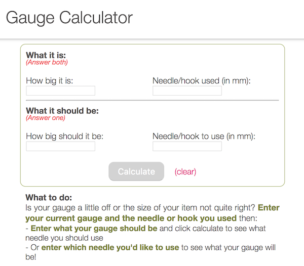

# Gauge Calculator

See it live: [gaugecalculator.surge.sh/](http://gaugecalculator.surge.sh/)

## Background

I was knitting a bunch of cute little things the other day in various colors when the blue one came out teeny-tiny! I started to calculate which needles I would need to use in order to get the blue ones to be the correct size - when I realized this would be a perfect app. 

## How to use

Enter in your current gauge or item size and which needle you used and then enter the gauge or size it _should_ be and the app will tell you which needle to use. Or conversely, enter in the needle you _want_ to use and it will tell you what your gauge will be. It's super handy and as soon as I finished the program I used it to calculate that I need to use 3.5 mm needles instead of 3 mm needles to get the blue thingy to be just the right size. 

## Features

* Whether you're calculating gauge or length or width or circumference it all works the same. Whatever unit you start with is the unit your results will be in. This app is very flexible and suitable for lots of scenarious. 
* Fractions accepted - enter your gauge or needle as 2.5 or 2 1/2. Program will convert from fraction to decimal before calculating.
* If the needle needed falls between two needle sizes you'll get results from both those needles and you can decide which one suits you. So, if a needle of size 3.2343 mm would get your correct size, the app will show you what your size will be with the 2 3/4 mm needle and the 3 1/4 needle and you can decide if you want it to be slightly smaller or slightly bigger.
* To help you make that choice, the app will also tell you how many units away each needle will get you. Maybe one needle gets you .25 inches smaller and the other one is 1 inch bigger - sure, you could do the math in your head, but now you don't have to. 
* Validation - lots of things are checked by the app. If the user tries to enter an invalid character (I'm looking at you, regex) the app will throw an error. The calculate button is disabled until the right amount of fields are filled in. Appropriate errors are displayed to help the user. 

## To do

This is yet another of my 1-day apps. It's a great start for one day. 

* If the user really wanted to, they could enter an invalid number to calculate. I have not checked for every possiblity. I suppose I could write more validation checks to make sure the number entered is valid, but I don't think I will. If you insist on being silly you will get a silly answer. 
